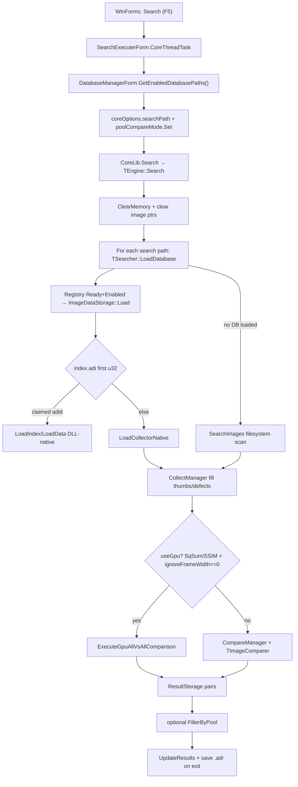

# AntiDuplPlus — Full Code Audit & Bug Hunt

| Field | Value |
|-------|--------|
| **Date** | 2026-07-17 |
| **Version** | `src/version.txt` → **2.5.0** |
| **Scope** | Full stack: native DLL (`src/AntiDupl/`), collector (`src/NvJpegCollector/`), Core interop, WinForms GUI; WPF noted only |
| **Method** | Source trace end-to-end + static verification of dual `.adi` magic on real `bin/Release/databases/*/index.adi`; no unit tests exist to run |
| **Code changes** | **None** (docs-only) |
| **Audience** | Junior / next agent |
| **Related** | `AGENTS.md`, `PROJECT_CONTEXT.md`, `IMPLEMENTATION_PLAN.md` |

---

## 0. How to use this document

1. Read **§1 Algorithm map + invariants** before any fix.
2. Fix bugs in **§4 day plan** order (P0 first).
3. Use **§5 patch sketches** as paste-oriented guidance — re-verify lines before editing (tree may drift).
4. After each fix, run the **Regression** checklist for that bug.
5. Product code must not change dual-format `.adi` wire layout without a coordinated loader update.

**Trust code over** older `PROJECT_CONTEXT.md` / `IMPLEMENTATION_PLAN.md` when they conflict. This audit re-verified key claims.

---

## 1. Algorithm map (end-to-end) + invariants

### 1.1 Happy path (primary product workflow)



### 1.2 Collector path (DB creation)

```
NvJpegCollector --input <folder> [--name] [--size 32] [--update]
  → decode JPEG (nvJPEG RGBI + aligned pitch) / other formats CPU
  → blockiness/blurring + average/variance
  → raw fwrite index.adi + 0000.adi (Collector-native)
  → register in ad_database.xml
```

### 1.3 Result handling path

```
ResultsListView / AutoSelector
  → Delete: CoreLib.ApplyToResult(DeleteFirst|Second) → RecycleBin FileDelete(FOF_ALLOWUNDO)
  → Batch move: System.IO.File.Move only (no ApplyToResult)  ← BUG-06
  → CheckImageData() after batch success
  → On exit: StartFinishForm saves mistakes + results (.adr)
```

### 1.4 Invariants (do not break while fixing)

| ID | Invariant |
|----|-----------|
| I1 | **Two `.adi` formats**: DLL-native (`"adii"` index / `"adid"` data) vs Collector-native (first u32 = ThumbSize). Loaders must not mix. |
| I2 | **Collector wire layout** in `NvJpegCollector/main.cpp` must stay compatible with `LoadCollectorData`. |
| I3 | **Portable paths**: `ad_database.xml`, `databases/<Name>/` relative to exe. |
| I4 | **Interop**: `CoreDll` structs / exported C API binary layout. |
| I5 | **GPU AllVsAll** uses host packing of `data->main` with a single `thumbSize`; all thumbs in one search must match that size. |
| I6 | **Surgical changes** only; no drive-by refactors (`.agents/skills/karpathy`). |

---

## 2. Confirmed bugs (P0 → P3)

### BUG-01 [P0] Thumb size mismatch → heap OOB / silent wrong compares

**Where:**  
- Pack: `adEngine.cpp` `ExecuteGpuAllVsAllComparison` (~309–338)  
- Alloc: `adPixelData.cpp` (~29–40) — buffer is `side*side`  
- Load: `adImageDataStorage.cpp` `LoadCollectorData` uses `TImageData(fileThumbSize)` (~576)

**Evidence:**

```309:338:src/AntiDupl/adEngine.cpp
        size_t reducedImageSize = m_pOptions->advanced.reducedImageSize;
        size_t thumbSize = reducedImageSize * reducedImageSize;
        ...
                allThumbnails.resize(validThumbBytes + thumbSize);
                memcpy(&allThumbnails[validThumbBytes], pImageData->data->main, thumbSize);
```

`memcpy` always copies **options** size, not `pImageData->data->side`. If DB was built with `--size 16` and options are 32×32, this reads past `main`.

**Impact:** Crash / heap corruption (smaller DB thumb) or wrong similarity (larger DB thumb truncated). Default 32/32 hides the bug.

**Verify:**
1. Collector: `NvJpegCollector.exe --input <dir> --name t16 --size 16`
2. App options: Reduced image size = 32×32
3. Enable only that DB → Search with GPU  
4. Expect crash or nonsense differences under debugger.

**Fix (minimal):**
1. On collector load: if `fileThumbSize != options.advanced.reducedImageSize`, fail load with clear status **or** force options from registry `ThumbSize`.
2. In pack loop: use `data->side` and `assert(side == reducedImageSize)`; skip inconsistent images.

**Why safe:** Does not change collector format; only rejects/aligns inconsistent configs.

**Regression:**
- [ ] Search DB size 32 + options 32 → same pair count as before  
- [ ] Search DB size 16 + options 32 → error message, no crash  
- [ ] SSIM and SqSum both covered  

---

### BUG-02 [P1] DLL-native index magic detected as `"adid"` instead of `"adii"`

**Where:** `adImageDataStorage.cpp` `Load` (~174–176) vs constants (~42–43)

**Evidence:**

```42:43:src/AntiDupl/adImageDataStorage.cpp
	const char INDEX_CONTROL_BYTES[] = "adii";
	const char DATA_CONTROL_BYTES[] = "adid";
```

```174:176:src/AntiDupl/adImageDataStorage.cpp
			// DLL-native format starts with "adid" (0x64696461)  // WRONG comment
			isDllNative = (firstBytes == 0x64696461);           // "adid", not "adii"
```

Static check: LE `"adii"` = `0x69696461`, LE `"adid"` = `0x64696461`.  
`SaveIndex` writes `"adii"`. Real product DBs under `bin/Release/databases/*/index.adi` start with `20 00 00 00` (ThumbSize=32) — collector path unaffected.

**Impact:** Classic `user/images/NxN` cache (`useImageDataBase=true` default) and any DLL-native `Load`/`ClearDatabase` mis-route to `LoadCollectorNative` → load failure / garbage. Primary collector search still works.

**Verify:** After a search with “Use database of image” on, inspect `user/images/32x32/index.adi` hex (should be `adii`); call Load again → currently fails detect.

**Fix:**

```cpp
isDllNative = (firstBytes == 0x69696461); // "adii"
// optional: also accept legacy if any tool wrote wrong magic
```

**Why safe:** Aligns detect with writer; collector still uses non-magic ThumbSize values (16/32/64/128).

**Regression:**
- [ ] CPU scan → Save → Load DLL-native folder  
- [ ] Collector DB still loads  
- [ ] Mixed multi-DB search unchanged  

---

### BUG-03 [P1] Unbounded `fread` of thumbnail bytes (collector load)

**Where:** `adImageDataStorage.cpp` `LoadCollectorData` (~613–620)

**Evidence:**

```613:620:src/AntiDupl/adImageDataStorage.cpp
				fread(&thumbSizeVal, 8, 1, f);
				size_t thumbBytes = (size_t)thumbSizeVal;
				if (imageData.data && imageData.data->side == (int)fileThumbSize)
				{
					fread(imageData.data->main, 1, thumbBytes, f);
```

No check that `thumbBytes == side*side` (or `≤ full` accounting for `fast` layout — main is only `side*side`).

**Impact:** Corrupt/malicious `0000.adi` → buffer overflow.

**Verify:** Craft record with `thumbBytes = side*side + 4096`; load under ASan/debugger.

**Fix:**

```cpp
size_t expected = (size_t)fileThumbSize * (size_t)fileThumbSize;
if (thumbBytes != expected) { fclose(f); return false; }
```

**Why safe:** Valid collector always writes exact thumb size.

**Regression:**
- [ ] Load existing production DBs  
- [ ] Corrupt file fails cleanly without crash  

---

### BUG-04 [P1] GPU path ignores CPU compare filters (type/size/ratio/folder/transforms/min-max size)

**Where:**  
- GPU: `ExecuteGpuAllVsAllComparison` + `adGPU.cu` kernels  
- CPU filters: `TImageComparer::IsDuplPair` (~240–259), `TCompareManager::CanCompare` (~320–326)

**Evidence:** CPU applies `typeControl`, `sizeControl`, `ratioControl`, `compareInsideOneFolder`, `compareInsideOneSearchPath`, `transformedImage`, min/max image size. GPU path only applies difference threshold, CRC penalty, optional pool mask; always `AD_TRANSFORM_TURN_0`.

**Impact:** With GPU on (default for SqSum/SSIM and `ignoreFrameWidth==0`), UI options for those filters are **silently ignored** → extra false positives / pairs user expected to suppress.

**Verify:** Disable “compare inside one folder”; place duplicates in same folder; GPU Search still reports them.

**Fix (prefer host prefilter):**
1. When packing `valid` images, drop those outside min/max size.  
2. When emitting matches (MatchCallback), re-run the same boolean filters as `IsDuplPair` (without redoing pixel math).  
3. Document that GPU does not support transforms until implemented; force CPU if `transformedImage`.

**Why safe:** Default options often leave filters off; enabling filters should only **reduce** pairs.

**Regression:**
- [ ] Filters off → pair count matches previous GPU run  
- [ ] Each filter on → matches CPU behavior on a small fixture set  
- [ ] Pool modes still work  

---

### BUG-05 [P1] Batch Auto-Select **move** does not update core results

**Where:** `AutoSelector.ExecuteBatch` (~188–208)

**Evidence:** Delete path calls `ApplyToResult(DeleteFirst|Second)`. Move path only:

```207:208:src/AntiDupl.NET.WinForms/AutoSelector.cs
                            System.IO.File.Move(sourcePath, destPath);
                            ok = true;
```

No `RenameCurrent` / `ApplyToResult(Move*)` / result removal. Then `CheckImageData()` drops missing files from image DB, but **result list still holds old paths**.

**Impact:** UI shows broken previews; re-delete/re-move targets wrong paths; results/DB desync until refresh/search.

**Verify:** Auto-select mark → Move Selected → open preview of moved side → fail; results still list old path.

**Fix:** After successful move, either:
- Call native rename/move API for current result, or  
- `ApplyToResult` equivalent that updates path / removes pair, or  
- Remove result rows for moved files and force `UpdateResults`.

Prefer reusing existing `LocalActionType.Move*` / `RenameCurrent` if they update storage correctly.

**Why safe:** Aligns move with delete’s use of core API.

**Regression:**
- [ ] Move one marked image → result path updated or pair removed  
- [ ] File exists at destination  
- [ ] Delete batch still works  
- [ ] Failed move counted in `BatchResult.Failed`  

---

### BUG-06 [P1] Finish path can `Dispose` core while worker still saving

**Where:** `MainForm.OnFormClosed` (~109–112), `StartFinishForm.WaitForWorker` (~164–167)

**Evidence:**

```109:112:src/AntiDupl.NET.WinForms/Form/MainForm.cs
            startFinishForm.ExecuteFinish();
            startFinishForm.WaitForWorker(2000);
            m_core.Dispose();
```

Worker saves mistakes + results on a background thread. **2s hard timeout** then dispose — if save is slow (large `.adr`), use-after-free / truncated save.

**Impact:** Lost results on exit; rare crash on close.

**Verify:** Large result set; inject delay in save; close app; observe incomplete `.adr` or crash.

**Fix:** `Join()` without short timeout (or long timeout + cancel), only dispose after `State.Finish`; disable close until done.

**Why safe:** Slightly longer shutdown is acceptable.

**Regression:**
- [ ] Normal exit saves results  
- [ ] Large result exit completes  
- [ ] No hang forever if native stuck (optional cancel)  

---

### BUG-07 [P2] `validCount < 2` reported as GPU failure

**Where:** `adEngine.cpp` (~373–376, ~725–727)

**Evidence:** Returns `false` → UI/status `"ERROR: GPU comparison failed..."`.

**Impact:** Empty/single-image DB looks like a GPU error.

**Fix:** Treat `validCount < 2` as success (zero pairs).

**Regression:** Search 0–1 image DB → clean empty results, no error string.

---

### BUG-08 [P2] Match buffer overflow silently drops pairs

**Where:** `adGPU.cu` (~131–146), host `BATCH_MATCHES = 5000000` (`adEngine.cpp` ~387)

**Evidence:** `atomicAdd` then write only if `idx < maxMatches`; overflow pairs discarded; success still returned (warning only).

**Impact:** Dense near-duplicate corpora under-report matches.

**Fix:** Multi-pass drain, or fail/warn in UI when truncated (`bufferFullCount`).

**Regression:** Synthetic set with known C(n,2) near-dups under/over cap.

---

### BUG-09 [P2] `d_poolMask` VRAM leak on MS AllVsAll error paths

**Where:** `adGPU.cu` `GpuCompareAllVsAll` (~656–677)

**Evidence:** `cudaMalloc` pool mask; kernel launch/sync failure frees thumbs/CRC/results/count **not** `d_poolMask`. SSIM path has cleanup.

**Impact:** Repeated failed GPU compares with pool mode → VRAM leak.

**Fix:** Free `d_poolMask` on all exits (shared cleanup label).

**Regression:** Force fail after pool alloc; `cudaMemGetInfo` stable.

---

### BUG-10 [P2] No GPU→CPU fallback on compare failure (known V06)

**Where:** `adEngine.cpp` (~725–728)

**Evidence:** On `!gpuSuccess` only sets error status; does not start `TCompareManager`.

**Impact:** Transient CUDA/OOM → zero useful results.

**Fix:** If `checkOnEquality`, fall back to CPU compare manager.

**Regression:** Force GPU fail → CPU pairs still produced (slower).

---

### BUG-11 [P3] Collect thread count ignores “GPU max threads” intent

**Where:** `adEngine.cpp` `CollectManager::Start()` (~601) before `m_skipComparisonDuringCollection = true` (~632); `DefaultThreadCount` (~406–408)

**Impact:** Perf only — fewer collect threads on GPU searches.

**Fix:** Set skip flag (or pass useGpu) before `Start()`.

---

### BUG-12 [P3] Any successful DB load skips all filesystem scans

**Where:** `adEngine.cpp` (~563–597)

**Evidence:** `SearchImages()` only if `!dbLoaded`.

**Impact:** Hybrid “DB path + raw folder” only loads DBs.

**Fix:** Per-path load-or-scan.

---

### BUG-13 [P3] Collector writes `hash = 0` for all images

**Where:** `NvJpegCollector/main.cpp` (multiple sites)

**Impact:** Multimap clustering on key 0 → slower `Find` on huge DBs. **Not** a staleness bug: `Actual()` uses path+size+time only.

**Fix (optional):** Store path CRC or content hash.

---

### BUG-14 [P3] No automated tests; CI is build-only

**Where:** Solution / `.github/workflows/AntiDupl_CI.yml`

**Impact:** Regressions on dual format / GPU packing / batch move go unnoticed.

**Fix:** Add focused unit tests (format detect, thumb size guard, AutoSelector batch) + one smoke script.

---

### BUG-15 [P3] Docs / plan drift

**Where:** `IMPLEMENTATION_PLAN.md` still says DLL-native index starts with `"adid"`; `PROJECT_CONTEXT` P/Invoke path `CoreDll.cs` without `Original/`.

**Impact:** Agents implement wrong magic / wrong paths.

**Fix:** Point docs to this audit + `AGENTS.md` (done for AGENTS; plan not rewritten here unless requested).

---

## 3. Checked and NOT bugs

| Claim | Verdict |
|-------|---------|
| SSIM average/variance missing from collector DBs | **False** — written after thumb; loaded in `LoadCollectorData` |
| Immediate delete uses temp queue | **False** — `TRecycleBin::Delete` → `FileDelete` + `FOF_ALLOWUNDO` |
| `Actual()` must check hash | **Not required** given collector hash=0; path+size+time is intentional |
| Dual format “doesn’t exist” | **False** — both exist; collector is primary in practice |
| Pool GPU mask + host `FilterByPool` double-filter | Redundant but consistent — not a bug |
| Skip CPU compare during GPU collect | Intentional |
| `AddDuplImagePair` locking | Adequate for GPU single-thread callback + CPU multi-thread |
| Collector pitch `((w*3+31)/32)*32` | Correct for RGBI path |
| nvJPEG batch size 1 | Present in collector |
| Prior audit V01–V07 / FIND-* listed as fixed in PROJECT_CONTEXT | Not re-opened without counter-evidence; batch move gap remains as BUG-05 |
| Default collector DB load (ThumbSize 32) | Works — verified `20 00 00 00` on disk |

---

## 4. Fix order for junior (day plan)

| Day | Items | Goal |
|-----|-------|------|
| **1** | BUG-01, BUG-03 | Memory safety on load/compare |
| **1–2** | BUG-02 | Restore DLL-native / image cache load |
| **2** | BUG-05, BUG-06 | Result integrity + safe shutdown |
| **3** | BUG-04 | GPU honors compare options (or documented CPU fallback) |
| **4** | BUG-07, BUG-09, BUG-10 | UX + VRAM + fallback |
| **5** | BUG-08, BUG-11–14 | Caps, perf, hybrid scan, tests |

Do **not** start with hash=0 or WPF polish.

---

## 5. Patch sketches (copy-oriented)

### 5.1 Magic detect (BUG-02)

```cpp
// adImageDataStorage.cpp — Load()
const uint32_t MAGIC_ADII = 0x69696461u; // "adii" LE
isDllNative = (firstBytes == MAGIC_ADII);
```

### 5.2 Thumb bounds (BUG-03)

```cpp
size_t expected = (size_t)fileThumbSize * (size_t)fileThumbSize;
if (thumbBytes != expected) {
    fclose(f);
    return false;
}
fread(imageData.data->main, 1, expected, f);
```

### 5.3 Pack guard (BUG-01)

```cpp
if (!pImageData->data || !pImageData->data->filled || !pImageData->data->main)
    continue;
if ((size_t)pImageData->data->side != reducedImageSize)
    continue; // or fail entire search with message
memcpy(..., pImageData->data->main, thumbSize);
```

### 5.4 Batch move (BUG-05) — direction

Prefer native path update after move, e.g. pattern used elsewhere:

```csharp
// After File.Move success:
// Option A: core.RenameCurrent(...) if API fits
// Option B: ApplyToResult(Move*) if implemented for folder targets
// Option C: remove pair from results + CheckImageData
core.CheckImageData();
// Always refresh UI via UpdateResults
```

### 5.5 Shutdown (BUG-06)

```csharp
startFinishForm.ExecuteFinish();
startFinishForm.WaitForWorker(Timeout.Infinite); // or Join without 2s cap
m_core.Dispose();
```

---

## 6. Performance notes for proposed fixes

| Fix | Perf impact |
|-----|-------------|
| BUG-01/03 guards | Negligible |
| BUG-04 host filter on matches | O(matches); cheap vs GPU kernel |
| BUG-08 multi-pass | Extra kernel launches only when over cap |
| BUG-10 CPU fallback | Slow path only on GPU failure |
| BUG-11 collect threads | Faster collect on multi-core |

Avoid “raise GPU block count” without measuring; consumer GPUs already use AllVsAll.

---

## 7. Functionality that must remain

- Collector-native DB create/update (`--update`)  
- Multi-DB load + Pool1/Pool2 modes  
- GPU SqSum + SSIM AllVsAll  
- CPU path when `ignoreFrameWidth != 0` or no GPU  
- Portable `ad_database.xml` + relative DB folders  
- Results save/load (`.adr`)  
- Auto-Select AND-criteria + delete batch  
- Recycle-bin delete (undo via shell)  
- WinForms as primary UI  

---

## 8. Hotspots table

| Area | Files |
|------|--------|
| Search orchestration | `adEngine.cpp` |
| Dual format I/O | `adImageDataStorage.cpp`, `NvJpegCollector/main.cpp` |
| GPU kernels / VRAM | `adGPU.cu`, `adGPUManager.*` |
| CPU compare filters | `adImageComparer.cpp`, `adThreadManagement.cpp` |
| Registry | `adDatabaseRegistry.cpp`, `DatabaseManagerForm.cs` |
| Search UI thread | `SearchExecuterForm.cs` |
| Batch actions | `AutoSelector.cs`, `MainMenu.cs` |
| Interop | `Original/CoreDll.cs`, `CoreLib.cs` |
| Shutdown | `MainForm.cs`, `StartFinishForm.cs` |
| Packaging | `cmd/MakeBin.cmd`, CI workflow |

---

## 9. Summary table

| ID | Sev | Title |
|----|-----|-------|
| BUG-01 | **P0** | Thumb size options ≠ DB side → OOB / wrong compare |
| BUG-02 | **P1** | Index magic `"adid"` vs real `"adii"` |
| BUG-03 | **P1** | Unbounded collector thumb `fread` |
| BUG-04 | **P1** | GPU ignores type/size/ratio/folder/transform/min-max |
| BUG-05 | **P1** | Batch move leaves stale results |
| BUG-06 | **P1** | Dispose after 2s while finish worker may still run |
| BUG-07 | **P2** | &lt;2 images → fake GPU error |
| BUG-08 | **P2** | Match cap silent drop |
| BUG-09 | **P2** | poolMask VRAM leak on error |
| BUG-10 | **P2** | No GPU→CPU fallback |
| BUG-11 | **P3** | Collect threads / skip flag order |
| BUG-12 | **P3** | DB load disables FS scan |
| BUG-13 | **P3** | hash=0 clustering |
| BUG-14 | **P3** | No tests |
| BUG-15 | **P3** | Docs drift |

**P0 count:** 1  
**P1 count:** 5  

---

## 10. Sign-off

| Check | Status |
|-------|--------|
| Every P0/P1 has file evidence | Yes |
| Algorithm map | Yes |
| Invariants | Yes |
| Not-a-bug section | Yes |
| Project-specific fix sketches | Yes |
| Tests run | **N/A** — no suite; static + on-disk magic check only |
| Product code changed | **No** |

**Suggested next step for human:**  
`implement BUG-01 + BUG-03 only` or `implement WP-0 from docs/DEV_GUIDE_RELIABILITY_GPU_DB_2026-07-17.md`.

---

*End of full audit — 2026-07-17*
